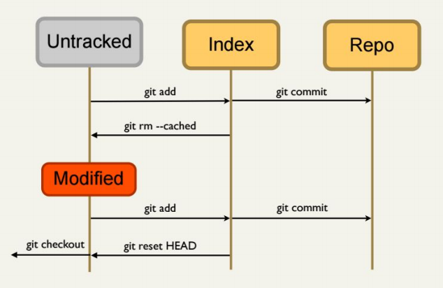

<!-- Slide 1 -->

## Introdução ao<br>Git e Github

---

<!-- Slide 2 -->

Jonadabe de Souza Nascimento

Desenvolvedor web +4 anos de experiência.

Github: [jhonndabi](https://github.com/jhonndabi)

LinkedIn: [jonadabe-nascimento](https://www.linkedin.com/in/jonadabe-nascimento/)

Email: [jhonndabi.s.n@gmail.com](jhonndabi.s.n@gmail.com)

---

<!-- Slide 3 -->

Agenda

<ul>
    <li>Sistema de controle de versão (VCS)</li>
    <li>Sobre o Git</li>
    <li>Sobre o Github</li>
    <li>Working areas</li>
    <li>Commits</li>
    <li>Stashes</li>
    <li>Branches</li>
    <li>Boas práticas</li>
</ul>

---

<!-- Slide 4 -->

Por que usar sistema para controle de versão?

<ul>
    <li>Armazenamento</li>
    <li>Versionamento</li>
    <li>Trabalho Simultâneo</li>
</ul>

Note:

Compartilhar projetos

Utilizar DropBox, pen drives ou afins para compartilhar código muitas vezes resulta em dor de cabeça.


---

<!-- Slide 5 -->

Onde um sistema para controle de versão pode ser útil?

<ul>
    <li>Desenvolvimento de software</li>
    <li>Trabalhos da Faculdade</li>
    <li>TCC</li>
    <li>Escrever um livro</li>
</ul>

---

<!-- Slide 6 -->

Qual a utilidade de um sistema para controle de versão?

<ul>
    <li>Visualizar as mudanças ocorridas em cada arquivo</li>
    <li>Visualizar o estado do projeto em etapas anteriores</li>
    <li>Desfazer mudanças</li>
    <li>Desenvolver funcionalidades em paralelo</li>
</ul>

---

<!-- Slide 7 -->

Sobre o


---

<!-- Slide 8 -->

O que é GIT

<ul>
    <li>Sistema de controle de versão de arquivos</li>
    <li>Projetos na qual diversas pessoas podem contribuir simultaneamente</li>
    <li>Sem risco de suas alterações serem sobrescritas pela ferramenta</li>
</ul>

---

<!-- Slide 9 -->

Desenvolvido por Linus Torvalds


---

<!-- Slide 10 -->

O Git foi inicialmente projetado e desenvolvido por Linus Torvalds para o desenvolvimento do kernel Linux.

Baseado na experiência de uso de Linus no software comercial BitKeeper.

---

<!-- Slide 11 -->

Multiplataforma


---

<!-- Slide 12 -->

Quem usa GIT?


---

<!-- Slide 13 -->

Sobre o Github


---

<!-- Slide 14 -->

Github

<ul>
    <li>Rede social</li>
    <li>Gratuito para projetos Open Source</li>
    <li>Repositórios privatos são pagos.</li>
    <li>Compatível com Mercurial e Subversion.</li>
    <li>
        <a href="https://education.github.com/pack" target="_blank">
            Github educacional
        </a>
    </li>
</ul>

---

<!-- Slide 15 -->

Vamos começar!

---

<!-- Slide 16 -->

Configuração de ambiente

Estabelecendo uma identidade para os commits

```shell
git config --global user.name "José da Silva"
git config --global user.email "jose@gmail.com"
git config --global color.ui true
git config --global core.editor code
```

---

<!-- Slide 17 -->

Inicializando o repositório

```shell
cd ~
mkdir minicurso-git
cd minicurso-git

## Inicializando um repositório git:
git init

## Abrir visual studio code
```
---

<!-- Slide 18 -->

Obtendo ajuda do git

```shell
## Comando para ajuda:
git help <comando>
git help init

## Ler mensagens fornecidas pelo git
```

---

<!-- Slide 19 -->

Adicionando arquivos

```shell
## Verificar estado dos arquivos do projeto:
git status

## Adicionar modificações na área de staging:
git add <files/directories>
```
```shell
## Remover modificações da área de índice:
git rm --cached <file>

## Ou
git rm -r --cached <directory>
```

---

<!-- Slide 20 -->

Criando commits

```shell
## Realizar um commit e enviar modificações
## para o repositório local:
git commit -m "Descrição do commit"

## Verificar histórico de commits:
git log
```

---

<!-- Slide 21 -->

Áreas de trabalho do git


---

<!-- Slide 22 -->

Refazendo commits

```shell
git add <modificações para serem incluídas>
git commit -m "first commit" --amend

```

---

<!-- Slide 23 -->

Desfazendo um commit - Hard mode

```shell
## Voltar um commit (~1)
## --hard indica que o(s) commit(s)
## bem como suas alterações serão apagadas
git reset HEAD~1 --hard
git status
```

```shell
## É possível recuperar um commit
## Que foi removido com o reset hard
git reflog

git merge <SHA1_to_restore>
```

Note:

Analogia da caixa, remove a caixa com todo o conteúdo dentro

---

<!-- Slide 24 -->

Desfazendo um commit - Soft mode

```shell
## Voltar um commit (~1)
## --soft indica que o(s) commit(s)
## serão apagados, mas as alterações não.
## As alterações voltam para o índice
git reset HEAD~1 --soft
git status
```

```shell
## Retirar modificações do índice
git reset HEAD
```

Note:

Analogia da caixa, remove a caixa, mas antes retira o conteúdo dela e devolve

---

<!-- Slide 26 -->

Fluxo simplificado



---

<!-- Slide 27 -->

Visualizando as modificações de um arquivo

```shell
git diff

git diff <nome-do-arquivo>
```

---

<!-- Slide 28 -->

Ignorando arquivos com `.gitignore`

```shell
vendor/
node_modules/
/log/*.log
```
Forçar o arquivo ignorado a ir para a área de índice

```shell
git add <file> -f
```

---

<!-- Slide 29 -->

Adicionando exceções no `.gitignore`

```shell
/cache/*
!/cache/.gitkeep
```

---

<!-- Slide 30 -->

Agora imaginem a seguinta situação
<ul>
    <li>Você está desenvolvendo novas funcionalidades.</li>
    <li>Surge um bug em outra parte do sistema para resolver.</li>
    <li>Você não quer commitar, pois ainda não terminou a adição das funcionalidades.</li>
    <li>O que fazer?</li>
</ul>

---

<!-- Slide 31 -->

Stashes

<ul>
    <li>4ª área do git</li>
    <li>Área temporária</li>
</ul>

---

<!-- Slide 32 -->

Movendo arquivos para a área temporária

```shell
## Adicionar modificações na área de staging
git add .

## Mover modificações para uma stash
git stash

## Mover modificações para uma stash
## Adicionando uma identificação
git stash save "Description"
```

---

<!-- Slide 33 -->

Listando arquivos da área temporária

```shell
## Ver lista de stashes criados
git stash list
```

---

<!-- Slide 34 -->

Recuperando arquivos da área temporária

```shell
## Recuperar as modificações movidas para a stash
## Recupera a última salva na stash
git stash apply

## Recuperar as modificações movidas para a stash
## Recupera de acordo com a identificação
git stash apply stash@{ID}
```

---

<!-- Slide 35 -->

Aplicando e excluindo um stash

```shell
## Aplicar stash mais recente e apagá-la:
git stash pop
```

---

<!-- Slide 36 -->

Apenas remover um stash

```shell
## Para visualizar o id do stash
git stash list

## Apagar stash
git stash drop stash@{ID}
```

---

<!-- Slide 37 -->

Limpando a área temporária

```shell
## Apagar todos os stashes gravados:
git stash clear
```

---

<!-- Slide 38 -->

Branches

---

<!-- Slide 39 -->

O Git permite criar uma linha independente de desenvolvimento no seu projeto.

Isto permite alterações em partes específicas do software sem comprometer o restante do projeto.

---

<!-- Slide 40 -->


---

<!-- Slide 41 -->

Listando branches

```shell
## Além de listar
## ele aponta qual é a branch corrente
git branch
```

---

<!-- Slide 42 -->

Criando branches

```shell
## Comando para criar uma branch:
git branch <branch_name>

## Criar e ir para branch criada.
git checkout -b <branch_name>

## A branch é criada a partir
## do último commit da branch corrente.
```

---

<!-- Slide 43 -->

Navegando entre branches e commits

```shell
## Para trocar a branch corrente
git checkout <branch_name>

## Para voltar em commit específico
git checkout <commit_SHA1>
```

---

<!-- Slide 44 -->

Branches são ramificações no meu projeto

Como fazer para unificar ramificações?

---

<!-- Slide 45 -->

Unificando branches

```shell
## Navego para a branch
## onde desejo receber as modificações
git checkout master

## E digo de onde quero pegar as modificações
git merge <branch_name>
```

---

<!-- Slide 46 -->

Deletando branches

```shell
## Após o merge, muitas vezes a branch
## não será mais necessária,
## podendo assim ser apagada.
git branch -d <branch_name>
```

---

<!-- Slide 47 -->

Repositórios online

Criando um repositório no Github

---

<!-- Slide 48 -->

Enviando modificações para o Github

```shell
## Enviar modificações para o servidor:
git push <remote_name> <branch_name>
git push origin master
```
---

<!-- Slide 49 -->

Sincronizando a branch local com o Github

```shell
## Baixar atualizações do servidor:
git pull <remote_name> <branch_name>
git pull origin master

## OBS:
## git pull = git fetch + git merge FETCH_HEAD
```

---

<!-- Slide 51 -->

Boas Práticas

---

<!-- Slide 52 -->

Sobre commits

<ul>
    <li>Frases descritivas e diretas</li>
    <li>Não tenha medo de realizar commits</li>
    <li>Começar com letra maiúscula</li>
    <li>No máximo 50 caracteres</li>
</ul>

---

<!-- Slide 53 -->

Sobre commits

<ul>
    <li>Não colocar ponto no final</li>
    <li>Nunca em primeira pessoa</li>
    <li>Commits devem ser mudanças <br>pequenas e completas no código</li>
    <li>Aplicação deve funcionar sem eles</li>
</ul>

---

<!-- Slide 54 -->

Sobre branches

<ul>
    <li>NÃO trabalhar diretamente na branch master,<br>ou seja, os commits nela registrados são feitos<br>apenas via merge</li>
    <li>
        As branches podem ser marcadas de acordo<br>com suas finalidades, por exemplo:

        <ul>
            <li>hotfix/[número-da-versão]</li>
            <li>feature/new-calculator</li>
        </ul>
    </li>
</ul>

---

<!-- Slide 55 -->

Dúvidas?

---

<!-- Slide 56 -->

Obrigado
